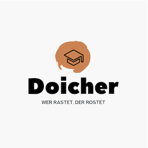

# Doicher Bot - телеграм бот для изучения немецкого языка
____




### Данный бот призван помочь в изучении немецкого языка.    
После авторизации пользователь будет получать сообщение с новым немецким словом и его переводом (каждые 2 часа)    
Изученные слова сохраняются в базу данных для использования в еженедельной статистике (wip)

Идеей для создания бота поступила цитата, которая сейчас находится в логотипе бота:
> Wer rastet, der rostet

Что дословно можно перевести как - "Тот, кто ничего не делает, покрывается ржавчиной".    
Именно с этой мыслью я приступил к разработке бота - помочь себе в практике немецкого языка, а также попрактиковаться в использовании Python.

**Опробовать бота можно здесь:** [Телеграме](http://t.me/doicher_bot).
____

## Оглавление

0. [Возможности бота](#Возможности-бота)
1. [Что внутри?](#Что-внутри?)
2. [Что в планах?](#Что-в-планах?)
3. [Настройки](#Настройки)

____

## Возможности бота

[](https://gifyu.com/image/STmHi)

____

### Регистрация в базе данных бота (Подписка на различные рассылки) ✅    
Бот отправляет каждые 2 часа в период с 10:00 до 20:00 всем подписанным пользователям новые слова.    
Все пользователи получают одинаковый набор слов.
```
/start
```

### Удаление своих данных из базы данных (Отключение рассылок) ✅
Пользователь удаляется из таблицы USERS и больше не получает автоматические рассылки от бота.    
Однако пользоваться функциями бота все еще можно, для этого не требуется авторизация в системе.
```
/stop
```

### Получить новое слово с переводом ✅
Если пользователю хочется узнать больше слов то у него для этого есть возможность.    
Команда генерирует случайное слово с переводом и отправляет его пользователю.
```
/word
```

### Получить статистику по изученным (отправленным) словам ❔
У пользователя есть возможность вывести статистику, которая будет включать в себя следующие пункты:
* Суммарное время взаимодействия с ботом
* Количество изученных (отправленных) слов
* Количество автоматически отправленных слов
```
/stat
```
____

## Что внутри?

### Бот написан с использованием:

* **pyTelegramBotAPI** -- отвечает за взаимодействие с Api телеграм
* **SQLAlchemy** -- общение и создание базы данных. В примере используется SQLite
* **Pillow** -- для генерации текста с переводами фраз на изображениях
* **deep-translator** -- для перевода слов с немецкого на русский. Используется Google Translate
* **TypeGuard** -- для разного TypeHinting. Этот момент все еще дорабатывается и есть не везде

____

## Что в планах?

На данный момент еще не реализованы, но планируется:

* Сбор различной статистики по запросам и новым пользователям
* Вывод еженедельной статистики по изученным словам
* Возможность отправлять и настраивать кастомные сообщения
* Улучшения работы с базой данных

____

## Настройки

В репозитории имеется Dockerfile. С помощью него можно собрать локально образ бота.
```
cd Doicher-Bot &&
docker build --tag doicher-bot .
```